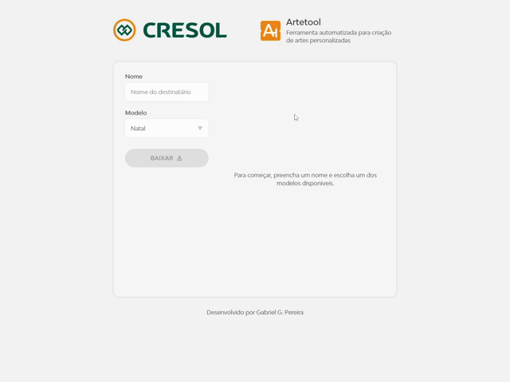

<div align="center">
  

  <h1>Artetool</h1>
 
  <p>Ferramenta interna para composição de artes temáticas utilizando HTML Canvas.</p>

[](https://artetool-kappa.vercel.app/) 

  

</div>

<br />

Ferramenta interna para geração automatizada de artes temáticas personalizadas. A aplicação compõe dinamicamente modelos gráficos com o nome do destinatário utilizando HTML Canvas, permitindo pré-visualização em tempo real e exportação da arte final em formato JPEG. Desenvolvida sob demanda para a Cresol via agência.

---

## Tecnologias Utilizadas

- HTML
- CSS
- TypeScript
- Vite

Devido ao tamanho reduzido do projeto e o foco no desempenho, a implementação é feita sem a utilização de frameworks e bibliotecas.

---

## Arquitetura

A aplicação foi projetada para gerar as artes de forma rápida, utilizando recursos do próprio navegador, sem a necessidade de operações em um servidor.

### Fluxo

1. **Seleção de nome e modelo**
   O usuário digita o nome do destinatário e escolhe o modelo que deseja.
2. **Geração da arte**
   A aplicação gera a arte utilizando a Canvas API.
3. **Pré-visualização**
   A aplicação atualiza a pré-visualização com a arte gerada.
4. **Download da arte**
   O usuário efetua o download da imagem em formato JPEG.

### Modelos

Os modelos são compostos por uma imagem base combinada com um objeto contendo parâmetros que definem como o nome do destinatário será inserido na imagem.

Entre os parâmetros disponíveis estão:

- Tipografia
- Posicionamento do texto
- Cor
- Dimensões da arte
- Qualidade de exportação

Essa abordagem permite:

- Configurar cada modelo conforme a demanda
- Facilidade para inserir ou remover modelos

### Canvas API

A utilização da Canvas API permite controle completo sobre a renderização de imagens e texto diretamente no navegador, utilizando métodos como `drawImage` para renderizar o modelo, `fillText` para renderizar o nome do destinatário e `toBlob` para extrair o conteúdo do Canvas como um binário.

### Pré-visualização com debounce

A pré-visualização deve atualizar sempre que o formulário sofrer alterações. Para fazer isso de forma eficiente, a geração da arte é controlada por um debounce, garantindo que a ferramenta não gere múltiplas artes em um curto espaço de tempo.

Essa abordagem evita processamento desnecessário e melhora a responsividade.

---

## UI / UX

A interface da ferramenta apresenta design inspirado em elementos do site oficial da Cresol, herdando tipografia, cores principais e estilo de botões, ao mesmo tempo em que adota decisões próprias devido ao contexto da aplicação. A interface é responsiva e pode ser utilizada em dispositivos móveis.

O fluxo de uso foi projetado para ser simples e direcionado a usuários não técnicos. A pré-visualização da arte fornece feedback imediato das alterações realizadas, permitindo um processo de criação rápido e intuitivo.

---

## Desafios Técnicos

### Refatoração e reorganização do projeto

O projeto passou por uma refatoração significativa com o objetivo de atualizar a base de código e melhorar a experiência de uso.

Nessa atualização foram adicionados o Vite e o TypeScript, buscando simplificar o desenvolvimento, manutenção e distribuição do projeto.

A estrutura de diretórios também foi revisada para melhorar a organização do código. Funções isoladas foram substituídas por uma classe responsável por encapsular o comportamento de geração das artes.

Além disso, o fluxo de uso foi revisado. A exibição do resultado final foi alterada de um modal para uma pré-visualização dinâmica, permitindo que o usuário acompanhe o resultado enquanto preenche os dados.

### Debounce assíncrono

O carregamento das imagens dos modelos para exibir a pré-visualização naturalmente possui natureza assíncrona, assim como a própria pipeline da Canvas API também conta com etapas assíncronas. Combinar esse comportamento com o debounce demandou a criação de uma implementação baseada em Promises de forma a garantir que apenas a última alteração do formulário resulte em uma nova arte.

Também foi necessário tratar as Promises pendentes visando evitar referências desnecessárias em memória.

---

## Possíveis Melhorias Futuras

- ### Personalização de modelos diretamente na UI

  Implementar a possibilidade de alterar os parâmetros dos modelos diretamente na interface com persistência local, aumentando a gama de personalização e ainda assim mantendo a ferramenta apenas client-side.

- ### Testes unitários

  Testes unitários permitiriam cobrir especialmente o Debounce assíncrono, dado que ele possui um comportamento sujeito a race conditions e Promises não resolvidas.

- ### Backend para manipular os modelos

  Implementar um backend permitiria o upload de novas imagens e o cadastro de novos modelos com persistência entre dispositivos.

- ### Exportação em múltiplos formatos e resoluções
  Permitir ao usuário escolher o formato e a resolução de exportação da arte (por exemplo, JPEG ou PNG). Isso tornaria a ferramenta mais flexível.

---

## Como rodar o projeto localmente

```bash
git clone https://github.com/gabriel23052/artetool.git
cd artetool
npm install
npm run dev
```
